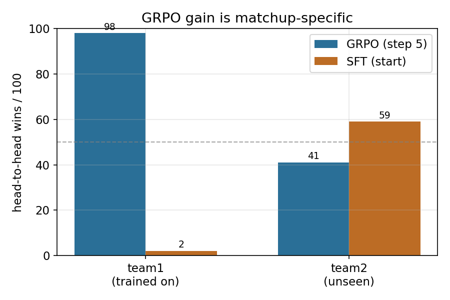

# Pokémon Showdown: SFT → GRPO on a 1.5B LLM

Fine-tuning **Qwen2.5-1.5B-Instruct** to play competitive **Gen 9 OU** on
[Pokémon Showdown](https://pokemonshowdown.com/), end to end, on a single
free-tier **T4** GPU: supervised fine-tuning on human replays, then online
**Group-Relative Policy Optimisation (GRPO)** with a constrained-decoding
battle agent.

> **What this is.** A complete, reproducible pipeline and an honest study of
> what small-scale on-policy RL actually does on this task. The headline is a
> negative-but-precise result: GRPO **overfits its training matchup
> spectacularly rather than learning to play the game**. It wins 98–2 against
> its own starting point on the team it trained on, and loses 41–59 on an
> unseen team. We characterise exactly how and why, and release everything.

---

## Headline results

**The generalization test.** Same GRPO checkpoint, same opponent (its SFT
starting point), same greedy decoding. The only thing that changes is the team.

| Matchup | GRPO wins / 100 | SFT wins / 100 | Median turns |
|---|---|---|---|
| **team1** (trained on) | **98** | 2 | 41 |
| **team2** (never seen) | **41** | 59 | 25 |

Both conditions are full-length battles (zero forfeits or timeouts), so the 98%
is real in-battle play. The collapse to 41% on an unseen team is matchup-specific
overfitting, shown under a clean controlled change of a single variable.



**Everything else we found:**

| Area | Finding |
|---|---|
| SFT bias | Vanilla SFT under-switches (switch-EM **14.8%**, move-EM 23.4%). Upsampling switches to 50% *inverts* the bias (switch-EM **88.9%**, move-EM **11.0%**) instead of fixing it. |
| Constrained decoding | Free generation is illegal on **97%** of turns; scoring legal actions under the policy drops that to **0%** and yields exact action log-probs for the gradient. |
| GRPO dynamics | Win rate rises to a peak (~step 8, 88% vs a scripted bot) then **collapses**; gradient norm diverges past 10³ over the same window. |
| Gradient-throttle pitfall | A clip + per-decision averaging combination held the effective step ≈ lr regardless of lr, silently flattening five runs. Caught only by measuring weight deltas directly. |
| Format confound | poke-env defaults to `gen9randombattle`. The RL phase trained off-distribution from the `gen9ou` SFT until this was found and corrected. |

---

## Why it matters

Prior LLM-Pokémon work either wraps a frozen frontier model in search
([PokéChamp](https://arxiv.org/abs/2503.04094)) or trains a small numeric policy
net ([Meta Discovery](https://arxiv.org/abs/2409.07340)). Whether you can
*fine-tune a small LLM end-to-end with on-policy RL* to play, and what breaks
when you try, was open. This repo answers it on a realistic budget (one T4),
and the failure modes (gradient variance and divergence, reward-proxy
exploitation, matchup overfitting, plus two silent implementation traps) are the
kind of thing larger-scale studies can afford to paper over and small-scale
practitioners cannot.

---

## Quickstart

```bash
pip install -r requirements.txt          # pinned: see versions below

# local Showdown server (needed for any live play). Detached so it survives
# notebook cell reruns, which was necessary in practice.
git clone --depth 1 https://github.com/smogon/pokemon-showdown.git
cd pokemon-showdown && npm install && cd ..
setsid nohup node pokemon-showdown/pokemon-showdown start --no-security > ps.log 2>&1 &
ss -ltn | grep 8000                      # confirm it is listening
```

Then run the pipeline stage by stage (`run.sh` has the exact commands):

```bash
python src/sft_data_prep.py                                   # replays -> JSONL
python src/split_eval.py split --data sft_train.jsonl         # leak-free split
python src/sft_train.py --data sft_train_split_train.jsonl --out adapters/sft_qwen_vanilla
python src/split_eval.py eval  --adapter adapters/sft_qwen_vanilla --test sft_train_split_test.jsonl
python src/rl_stage_c.py --adapter adapters/sft_qwen_balanced \
    --opponent maxpower --group-size 8 --lr 5e-5 --kl-beta 0.1 --steps 25 --out adapters/grpo_ou1
python src/rl_eval.py h2h --adapter-a adapters/grpo_ou1_step5 \
    --adapter-b adapters/sft_qwen_balanced --n-battles 100 --team team2
```

Pretrained adapters are on the [Releases](../../releases) page so you can skip
straight to evaluation.

---

## How it works

**1. SFT from replays** (`sft_data_prep.py`, `sft_train.py`). High-Elo gen9ou
replays are parsed into (state, action) text pairs; the state lists the turn,
active Pokémon and HP, and revealed teams, and the action is one line of JSON.
QLoRA (rank 16, 4-bit) with completion-only loss.

**2. Leak-free evaluation** (`split_eval.py`). Train/test split is **by replay
id**, so no battle's turns straddle both sides. Reports action-type accuracy
(AA), exact match (EM), and per-class switch/move EM.

**3. Balancing experiment** (`balance_data.py`). Upsamples switch decisions to
~50% in the training split only, to test whether the SFT action bias is just
class imbalance. It is not, the bias inverts.

**4. Constrained-decoding agent** (`rl_stage_a.py`). A poke-env `Player` that,
instead of free-generating an action string, enumerates the legal actions,
scores each candidate JSON completion under the policy in one batched forward
pass, and picks argmax (eval) or samples (training). Illegal actions become
impossible by construction, and the chosen action's exact log-prob is what GRPO
needs.

**5. GRPO** (`rl_stage_b.py`, `rl_stage_c.py`). Group rollouts give
group-relative advantages (terminal +1/-1, with optional dense HP-difference
shaping); the update reinforces advantage-weighted action log-probs with a KL
penalty to a frozen SFT reference. `ou_team.py` pins `gen9ou` and a fixed team
so RL matches the SFT distribution.

**6. Evaluation** (`rl_eval.py`). Static action-distribution metrics,
head-to-head live battles (the generalization test), and a logprob-drift
comparison between two adapters.

---

## Repository layout

```
src/
  sft_data_prep.py   download high-Elo gen9ou replays -> (state, action) JSONL
  split_eval.py      leak-free split by replay id; AA / EM / per-class eval
  balance_data.py    upsample switch decisions to ~50% (train only)
  sft_train.py       Unsloth QLoRA SFT (rank 16, completion-only loss)
  ou_team.py         gen9ou format + fixed teams (team1 trained, team2 unseen)
  rl_stage_a.py      constrained-scoring poke-env Player + trajectory logging
  rl_stage_b.py      GRPO group / dense advantages
  rl_stage_c.py      GRPO update loop (KL to frozen SFT reference)
  rl_eval.py         static / head-to-head / drift evaluation
  make_figures.py    regenerate the figures from results/
results/             FINAL_results.json, ou_final_result.json, grpo_ou1_result.json
figures/             training dynamics, SFT bias, generalization
data/sample_data.jsonl   20 example (state, action) rows
run.sh               full pipeline invocation
paper.pdf            the writeup
```

---

## Three things worth knowing if you build on this

1. **Pin the battle format.** poke-env silently defaults to
   `gen9randombattle`. If your SFT data is `gen9ou`, an unset format means RL
   trains on a different distribution. `ou_team.py` forces it for every player.
2. **Watch the gradient norm, not the loss.** Training here rises then diverges
   (norm → 10³⁺ past ~step 8–12). The useful checkpoints are early (step 5).
3. **Measure weight deltas directly.** `rl_stage_c.py` prints the max weight
   change after step 1. ~1e-5 means the policy is not actually moving (a
   post-clip gradient norm can look healthy while the step is throttled);
   ~1e-3 is a real update.

---

## Environment

Pinned to the exact stack used for these results:

```
Python 3.12.13 · torch 2.10.0 · transformers 5.5.0 · unsloth 2026.6.9
trl 0.24.0 · peft 0.18.1 · poke-env 0.15.0 · single Tesla T4
```

A local Node.js Pokémon Showdown server is required for live play (see
Quickstart); it is not a pip dependency.

---

## Related work

- **PokéChamp** (Karten et al., 2025, [2503.04094](https://arxiv.org/abs/2503.04094)), LLM in minimax search, no training.
- **PokeAgent Challenge** (Karten et al., 2026, [2603.15563](https://arxiv.org/abs/2603.15563)).
- **Meta Discovery** (Saravanan & Guzdial, 2024, [2409.07340](https://arxiv.org/abs/2409.07340)), small PPO net, not an LLM.
- **PokerBench** ([2501.08328](https://arxiv.org/abs/2501.08328)), trains LLMs for poker; SFT brittleness motivates RL.
- **poke-env** (Sahovic, 2019), the Showdown interface used here.

## License

MIT, see [LICENSE](LICENSE).
