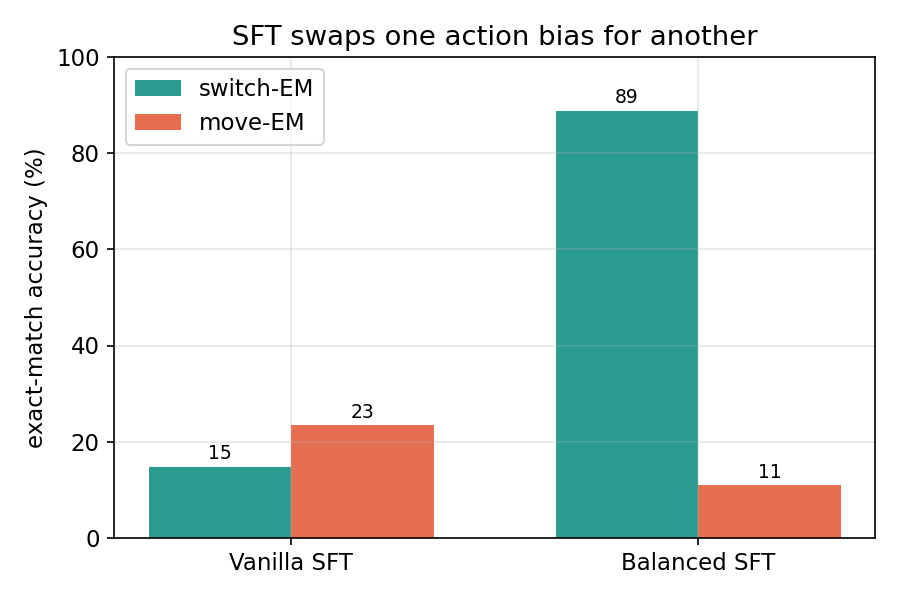
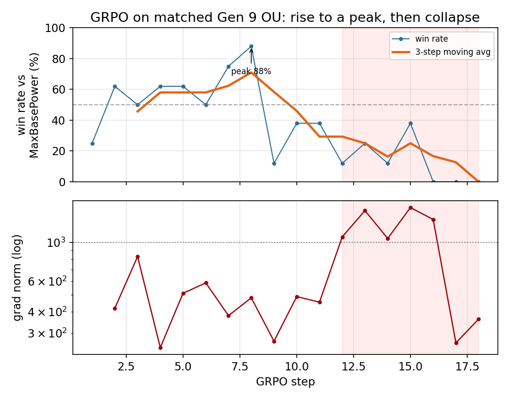

# Training a Small Language Model to Play Competitive Pokémon: An End-to-End SFT-to-GRPO Pipeline and Why On-Policy RL Is Hard at Small Scale

## Abstract

Recent work on language models for competitive Pokémon either wraps a frozen frontier model in minimax search (PokéChamp) or trains small numeric-input policy networks; whether a small language model can be fine-tuned end-to-end with on-policy reinforcement learning to play the game, and what fails when one tries, is open. We present an end-to-end pipeline that fine-tunes a 1.5B-parameter model (Qwen2.5-1.5B-Instruct) to play Gen 9 OU Pokémon on Pokémon Showdown, using supervised fine-tuning (SFT) on human replays followed by online Group-Relative Policy Optimisation (GRPO), all on a single free-tier T4 GPU. We report four findings. First, SFT on human replays produces a systematic action bias: the model under-switches (switch exact-match 14.8%), and naïve class rebalancing inverts the bias rather than removing it (switch exact-match 88.9%, move exact-match collapsing to 11.0%). Second, we introduce a constrained-decoding scheme that scores legal actions under the policy, eliminating illegal moves by construction (from 97% of turns to zero) and yielding exact log-probabilities for the policy gradient. Third, and most substantively, GRPO at this scale overfits to its training distribution rather than acquiring transferable skill: trained on a fixed Gen 9 OU matchup, the best checkpoint beats its SFT starting point 98–2 head-to-head on the team it trained against, but only 41–59 on an unseen team — the gain does not transfer. Training is also unstable, rising to a peak around step 8 before the gradient norm diverges and win rate collapses. Fourth, we document a gradient-throttling implementation pitfall that silently flattened five early runs, and a format confound (poke-env defaults to random battles) that initially hid the SFT distribution from the RL phase. We argue these failure modes are informative for anyone attempting on-policy RL of small models under compute constraints, and we release the full pipeline.

## 1. Introduction

Large language models have been applied to sequential decision-making games in two distinct ways. One line of work *trains* models for a specific game: PokerBench, for instance, fine-tunes LLMs to play poker and finds that supervised fine-tuning alone yields brittle, exploitable play. A separate line *prompts* frontier models to play Pokémon battles without any training, treating the model as a fixed policy. The natural intersection — actually training a language model to play competitive Pokémon — has not, to our knowledge, been attempted.

We address this gap with a complete pipeline built under deliberately tight constraints: a 1.5B-parameter model, free-tier GPUs (Colab then Kaggle, single T4), and QLoRA fine-tuning. The small scale is intentional: it makes the pipeline reproducible by anyone, and it surfaces the practical obstacles to on-policy RL that larger-scale studies can afford to paper over.

Our contributions are:

1. An end-to-end SFT-then-GRPO pipeline for Gen 9 OU Pokémon Showdown, including data extraction from human replays, a live battle agent built on poke-env, and an online GRPO loop with a frozen KL reference, all running on one T4.
2. A **constrained-decoding action mechanism** that scores each legal action under the policy rather than free-generating an action string, eliminating illegal moves (from 97% of turns to zero) and providing exact per-decision log-probabilities for the policy gradient.
3. An SFT result: imitation produces a systematic switch/move action bias that naïve class rebalancing inverts rather than corrects.
4. A controlled demonstration that small-scale GRPO overfits its training distribution: a checkpoint that wins 98–2 against its SFT start on the trained matchup wins only 41–59 on an unseen team. We pair this with a characterisation of the training dynamics (rise-then-diverge), a gradient-throttling implementation pitfall, and a format confound (poke-env's random-battle default), all documented as cautionary tales for on-policy RL of small models under compute constraints.

## 2. Related Work

**Training LLMs for games.** PokerBench trains LLMs to play poker via supervised fine-tuning and finds that SFT reproduces a narrow, over-passive strategy that is exploitable, motivating reinforcement learning. Our SFT findings echo this: imitation alone yields biased action selection.

**Prompting LLMs for Pokémon.** Recent work evaluates frontier models as Pokémon battle agents purely through prompting, with no parameter updates. This establishes that capable models can play but does not address whether smaller models can be *trained* to play.

**RL post-training of language models.** Group-Relative Policy Optimisation (GRPO) removes the value network of PPO by computing advantages relative to a group of sampled trajectories. It has become a standard tool for LLM post-training. We apply it in a multi-turn, sparse-reward setting (battle outcome) that differs from the single-turn preference settings where it is most commonly used.

**Pokémon Showdown agents.** The poke-env library provides a programmatic interface to Pokémon Showdown and scripted baseline agents. Prior RL work with poke-env targets small numeric-input policy networks, not language models; the LLM setting requires a different training loop, which we develop.

## 3. Method

### 3.1 Supervised fine-tuning from replays

We download high-Elo Gen 9 OU replays from the Pokémon Showdown public replay API and parse each battle log into (state, action) pairs. The state is rendered as a text prompt describing the turn number, the active Pokémon and their HP, and the revealed teams. The action is the move or switch the human chose, encoded as a single line of JSON. Turn-zero lead choices are excluded as they are not in-battle decisions. We fine-tune Qwen2.5-1.5B-Instruct with QLoRA (rank 16, 4-bit base) using completion-only loss, so that only the action tokens contribute to the objective.

### 3.2 The class-balance experiment

Human replay data is dominated by move actions (roughly 75%) over switches (roughly 25%). To test whether this imbalance drives the SFT policy's behaviour, we upsample switch decisions in the training split to a 50/50 ratio and retrain, evaluating both models on the same untouched, naturally-distributed test split.

### 3.3 Constrained-decoding action selection

A model fine-tuned on replay prompts, which do not enumerate the legal actions available at each turn, names actions from its prior when played live. In our initial live-play experiments this produced illegal actions on 97% of turns: the model named moves the active Pokémon did not possess, or switches to fainted or active Pokémon. Appending the legal action list to the prompt did not resolve this, as the SFT model was not trained to consult such a list.

We instead select actions by **constrained scoring**. At each decision, we enumerate the legal actions from the poke-env battle state, render each as a candidate JSON completion, and score each candidate's total token log-probability under the policy in a single batched forward pass. At temperature zero we take the argmax; at temperature greater than zero we sample from the softmax over candidate scores. This eliminates illegal actions by construction and, critically, yields the exact log-probability of the chosen action, which the policy gradient requires.

### 3.4 Online GRPO

We train with online GRPO. At each step we roll out a group of G full battles against a scripted opponent with a stochastic policy (temperature 0.6). Each battle yields a terminal reward (+1 win, −1 loss). The advantage of a decision is its reward normalised within the group. The loss per decision is the negative advantage-weighted log-probability of the chosen action plus a KL penalty against the frozen SFT reference. Gradients flow through the constrained-scoring log-probabilities into the QLoRA adapter; a frozen copy of the SFT model provides the KL reference. Both models fit on a single T4.

We also implement **dense reward shaping**: in addition to the terminal reward, each decision receives a small per-turn signal equal to the opponent's HP loss minus the agent's HP loss that turn, plus a faint differential. The terminal reward remains dominant. This assigns credit to individual decisions rather than sharing one outcome across all decisions in a battle.

## 4. Experiments and Results

### 4.1 SFT reproduces and inverts an action bias

Evaluating exact-match (EM) accuracy on a held-out split, separated by action type: vanilla SFT under-switches severely, achieving 23.4% move-EM but only 14.8% switch-EM — it defaults to attacking even when the human switched. Upsampling switches to 50% of the training set inverts the bias rather than removing it: balanced SFT reaches 88.9% switch-EM but move-EM collapses to 11.0%. Neither model recovers the correct action frequency. Naïve resampling relocates the bias from one action class to the other, motivating an outcome-driven objective. (Figure 2.)

### 4.2 Constrained decoding eliminates illegal actions

Free generation produced illegal actions on 97% of turns. Constrained scoring (Section 3.3) reduces this to zero by construction while preserving the model's action preferences and providing exact log-probabilities for RL. Against the scripted SimpleHeuristics opponent, the constrained SFT policy plays legal battles at a 40% win rate, establishing the pre-RL baseline.

### 4.3 GRPO overfits to its training matchup

**A format confound, and its correction.** poke-env defaults to the
`gen9randombattle` format when none is specified. Our initial RL runs
inherited this default and therefore trained and evaluated on random battles,
a different distribution from the `gen9ou` replays the policy was supervised
on. On that off-distribution setting the best checkpoint did not beat its SFT
start (131 of 300 head-to-head, 43.7%). Recognising the mismatch, we re-ran the
RL phase on `gen9ou` with a fixed team on both sides (a mirror match), so that
training, evaluation, and the SFT prior share the OU format. All results below
are from this corrected, format-matched setting.

**Rise then collapse.** On matched OU, the SFT-initialised policy is already
competitive against the scripted MaxBasePower opponent. GRPO pushes its win
rate up to a peak of 88% by step 8, after which the gradient norm climbs past
10^3 and the policy collapses: by step 17 it loses every battle in the group
(Figure 1).

 There is no learning rate that both moves the policy and stays
stable (Section 4.4, Table 1); at lr = 5e-5 training is productive for under
ten steps before diverging.

**The gain does not transfer (the central result).** We evaluate the best
pre-divergence checkpoint (step 5) head-to-head against its SFT starting point,
holding the opponent and greedy decoding fixed and varying only the team. On
the team it trained against, the GRPO checkpoint wins 98 of 100. On an unseen
OU team of a different archetype, it wins only 41 of 100 — losing to the SFT
baseline it started from. Both conditions are full-length battles (median 41
and 25 turns respectively, zero forfeits or timeouts), so the 98% reflects real
in-battle play, not a degenerate artifact. The collapse from 98% to 41% when
only the team changes shows that GRPO at this scale learned to exploit its
specific training matchup rather than acquiring transferable OU skill, and that
the matchup-specific optimisation slightly degraded general play.

This mirrors, at the level of training rather than prompting, the brittleness
PokéChamp reports for its agent on the live ladder: narrow competence that does
not cover the broader distribution.

### 4.3.1 The earlier off-distribution result

**No stable productive learning rate.** We find no learning rate that both moves the policy and remains stable. At lr ≤ 2e-5 the LoRA weights change by approximately 2e-5 per step and behaviour is unchanged. At lr ≥ 1e-4 the gradient norm diverges within ten steps. At lr = 5e-5 training is stable for roughly 25 steps before the gradient norm climbs past 10^3 (Figure 1, lower panel), while the win rate against the scripted opponent remains noisy around 30% and never trends upward (Figure 1, upper panel).

**Head-to-head evaluation.** We evaluated the best pre-divergence checkpoint directly against its SFT starting point. A 100-battle pilot suggested an edge (57%), but a 300-battle evaluation reversed it: the RL checkpoint won 131 of 300 (43.7%, p = 0.03), i.e. it does not beat the baseline. We report the pilot reversal as a caution on small-sample evaluation in this high-variance domain.

**Dense shaping stabilises but degrades.** Dense reward shaping eliminated the gradient divergence — the gradient norm remained bounded (approximately 300–500) for the full run rather than exploding. However, the policy degraded: over 19 steps the win rate drifted from 38% to zero, the mean shaped reward fell monotonically from −0.42 to −1.2, and the advantage variance collapsed. We attribute this to proxy over-optimisation: HP-preservation shaping rewards passive play that conserves the agent's HP while losing the game.

### 4.4 A gradient-throttling pitfall

Our first five training runs were flat not because RL failed but because of an implementation pitfall worth documenting. The update averaged gradients over the number of *decisions* in a group (roughly 550) and then clipped the gradient norm to 1.0. The combination made the effective step size approximately equal to the learning rate regardless of its value: the clip set the norm and the learning rate merely scaled a unit vector. The reported gradient norm of ~10 was the post-clip value and looked healthy, while the actual per-step weight change was on the order of 1e-5. We detected this only by directly measuring the weight delta after one step. Averaging by the number of trajectories instead of decisions, and loosening the clip, restored a weight change two orders of magnitude larger. We recommend that practitioners log weight deltas directly rather than trusting gradient-norm readouts when debugging silent under-training.

## 5. Discussion

Our results separate two distinct outcomes that a single win-rate number would conflate. On a fixed matchup GRPO *does* improve play, and dramatically (98–2 over the SFT start); but the improvement is matchup-specific and does not transfer to an unseen team (41–59), while general OU competence is, if anything, slightly degraded. The honest summary is therefore not "RL fails to learn" but "RL at this scale overfits its narrow training distribution." Both the instability and the overfitting are, we argue, informative. The terminal-reward setting suffers from high gradient variance: within a group, winning and losing trajectories push the same board states in opposite directions, so the net gradient is noisy and large, and any learning rate large enough to move the policy is also large enough to destabilise it. Dense shaping reduces this variance and restores gradient stability, but introduces a proxy-optimisation failure: the agent improves the shaped quantity (HP differential) while degrading the true objective (winning).

These are not exotic problems; they are the textbook difficulties of policy-gradient RL, surfacing sharply at small scale with sparse rewards and limited compute. The practical implication is that an LLM-Showdown agent likely requires either substantially more update steps than a free-tier budget allows, a larger base model, a more carefully designed dense reward that resists passive-play exploitation, or a more stable offline alternative such as reward-weighted regression on winning trajectories.

## 6. Limitations

Our study is constrained to a single 1.5B model, a single training opponent (MaxBasePower), and tens of GRPO steps rather than the thousands typical of successful LLM-RL. We do not report multiple seeds for the RL runs; the per-step win-rate variance is large, and the conclusions should be read as characterising a regime rather than precisely estimating effect sizes. The corrected RL phase trains on a single fixed OU team (a mirror match), which matches the OU format but covers only a narrow slice of the team diversity present in the SFT replays; the generalization test uses one held-out team, so "does not transfer" is established on a single unseen matchup rather than a broad distribution. The SFT evaluation uses a freshly drawn replay split, so absolute numbers are not directly comparable to runs on earlier data batches. The constrained-scoring action space, while eliminating illegal moves, omits some battle mechanics (e.g. Terastallisation choices) for simplicity. Finally, the SFT and RL phases use slightly different prompt formats (the RL prompt lists legal actions), which the model bridges during RL but which complicates direct cross-phase comparison.

## 7. Conclusion

We built and released an end-to-end pipeline for training a small language model to play competitive Pokémon, spanning replay-based SFT, a constrained-decoding live-play agent, and online GRPO on a single free-tier GPU. The pipeline works; the supervised phase reveals an instructive action-bias that resampling cannot fix; and the reinforcement-learning phase, on its matched training matchup, produces a large head-to-head gain over its supervised start that does not transfer to an unseen team — small-scale GRPO here overfits its narrow training distribution rather than learning general play, and does so unstably. We characterise the failure modes — gradient variance and divergence, reward-shaping proxy exploitation, matchup overfitting, a gradient-throttling pitfall, and a format confound — in the hope that they are useful to others attempting on-policy RL of small models under realistic compute budgets.

## Appendix A: Reproducibility and the weight-delta diagnostic

**Table A1: Learning-rate sweep (corrected GRPO, group rollouts vs MaxBasePower).**

| lr | per-step max weight Δ | gradient norm | behaviour |
|---|---|---|---|
| 2e-5 | ~2e-5 | bounded | stable but too small to change decisions |
| 5e-5 | ~1e-3 (by step 20) | ~300–500 rising to >10^3 | productive ~8 steps, then diverges |
| 1e-4 | — | >1000 within ~10 steps | diverges |
| 3e-4 | — | 1000–3600 | diverges |
| 1e-3 | ~1e-3 (one step) | ~600 | unstable |

**Weight-delta diagnostic.** `rl_stage_c.py` prints the maximum absolute change
in the LoRA weights after the first update. A change on the order of 1e-5 means
the policy is effectively frozen (greedy decisions will not flip); a healthy
update is ~1e-3. This single check is what exposed the gradient-throttling
pitfall (Section 4.4), which the post-clip gradient-norm readout had masked.

**The format confound.** poke-env constructs players with no `battle_format`
defaulting to `gen9randombattle`. Because the SFT data is `gen9ou`, the RL phase
ran off-distribution until `ou_team.py` pinned the format and a team for every
player. We flag this as an easy, silent mistake for anyone wiring poke-env into
an RL loop.

**Code.** Nine scripts: `sft_data_prep.py`, `split_eval.py`, `balance_data.py`,
`sft_train.py`, `ou_team.py`, `rl_stage_a.py` (constrained-scoring player),
`rl_stage_b.py` (group/dense advantages), `rl_stage_c.py` (GRPO update),
`rl_eval.py` (static / head-to-head / drift). Full pipeline invocation in
`run.sh`.

## Appendix B: Hyperparameters

**SFT.** Qwen2.5-1.5B-Instruct, QLoRA rank 16, 4-bit base, learning rate 2e-4,
2 epochs, completion-only loss (only action tokens contribute). Leak-free
train/test split by replay id.

**GRPO.** Group size 8–16, temperature 0.6 (rollout) / 0.0 (eval), KL-beta 0.1
to a frozen SFT reference, learning rate 5e-5 (from the sweep above), gradient
clip 1.0, gradients averaged by trajectory count. Terminal reward +1 win / −1
loss; optional dense shaping with HP-differential weight 1.0 and faint-
differential weight 0.3.

**Generalization eval (Table B1).** Best pre-divergence checkpoint (step 5) vs
its SFT start, greedy on both sides, 100 battles per team.

| Team | Status | GRPO wins / 100 | SFT wins / 100 | Median turns |
|---|---|---|---|---|
| team1 | trained on | 98 | 2 | 41 |
| team2 | unseen | 41 | 59 | 25 |

**Environment.** Python 3.12.13, torch 2.10.0+cu128, transformers 5.5.0,
unsloth 2026.6.9, trl 0.24.0, peft 0.18.1, poke-env 0.15.0; single Tesla T4.

